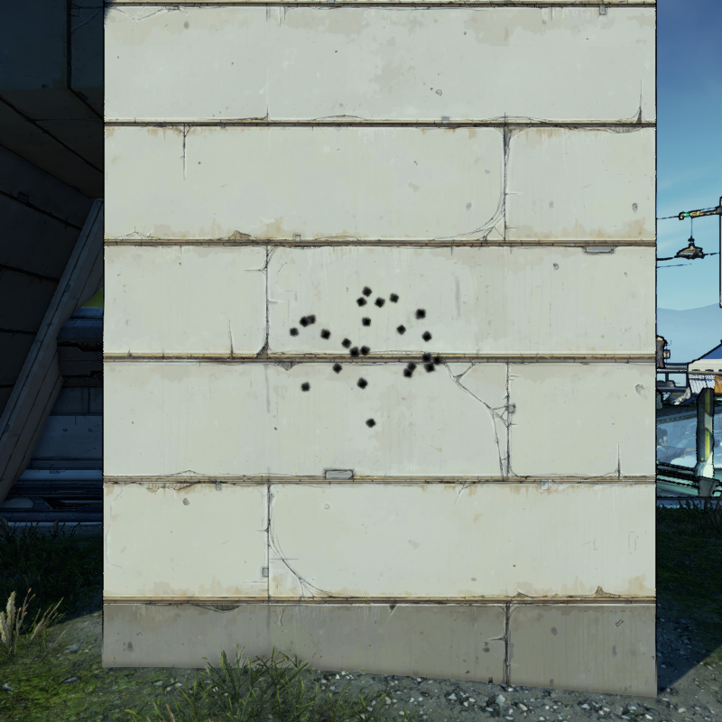
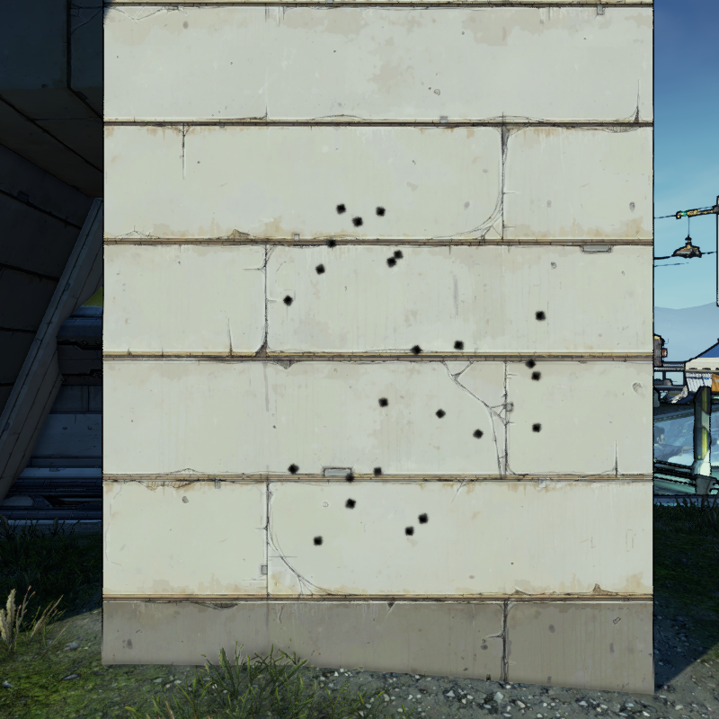

# Accuracy Mechanics
Accuracy is actually a bit more complicated than you might think.

## Basics
When you fire a shot, the direction of each projectile is picked in two passes.
First, the game picks a general angle for the whole "cluster" of bullets to go, within the "cluster range".
Each individual projectile then adds it's own offset onto the general angle, adding the "weapon spread".

Some weapons with custom spread patterns predefine angles for the first pass.
Others spawn additional projectiles around the original ones, taking into account the final angles.

As you fire your shots get more inaccurate - this is done by increasing your cluster range.
Your cluster range rests at a base value normally, but is then increased up to a maximum when you shoot.
As it gets bigger, your shots can fire further and further out.
On idle you will naturally regen back towards the base value, so once you stop shooting you eventually get back to normal.

<table id="cluster_spread_table"><tr>
    <td></td><th>Low Cluster Range</th><th>High Cluster Range</th>
</tr><tr>
    <th>Low Weapon Spread</th>
    <td></td>
    <td></td>
</tr><tr>
    <th>High Weapon Spread</th>
    <td></td>
    <td></td>
</tr></table>

## Attributes
Accuracy is controlled by six attributes, listed below alongside with their effect when increased.



The accuracy stat on the weapon card is controlled by weapon spread.
Crosshair size is controlled by a combination of the weapon spread and the current cluster range.
Weapon sway is controlled by the current cluster range.
Recoil is controlled by impulse accuracy and sometimes burst impulse, based on how you're firing.

It is possible to get weapons where the min accuracy is greater than the max.
When this happens the cluster range simply stays constant, at the min accuracy value.

## Hyperion
Hyperion guns gain their special effect simply by inverting impulse accuracy and accuracy regen - impulse will be a negative value and regen will be a positive.
When you equip a gun the game essentially pre-regenerates the accuracy, so you'll start at the max accuracy.
As impulse accuracy is negative, each shot decreases the cluster range, increasing accuracy until you reach the min.
Then on idle the positive accuracy regen will increase the cluster range back to the maximum, base accuracy.

### Bonuses on Hyperion
*Grade*{:.grade} bonuses are always set up to invert these attributes properly.

*PreAdd*{:.pre-add} and *PostAdd*{:.post-add} bonuses will continue working as intended.
On normal guns you want lower (positive) impulse accuracy to increase the cluster range slower.
On Hyperion guns you also want lower (negative) impulse accuracy, this time to decrease the cluster range quicker.
The same logic holds for accuracy regen.

*Scale*{:.scale} bonuses are the one type that may have issues - multiplying a positive number makes it bigger but multiplying a negative makes it smaller.
Sometimes Gearbox gives a part Hyperion manufacturer bonuses to invert the intended bonus properly, but sometimes they forget and it actually has the opposite effect.
 TODO: are there actually examples where they forgot? 

It would theoretically be possible for various bonuses combined to push the impulse accuracy or accuracy regen back past 0, removing Hyperion's special behavior, but in practice this never happens.
